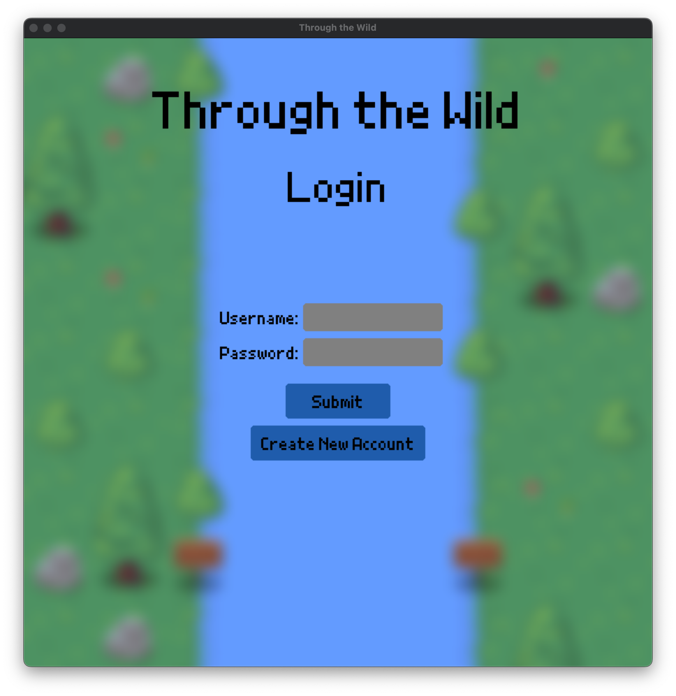
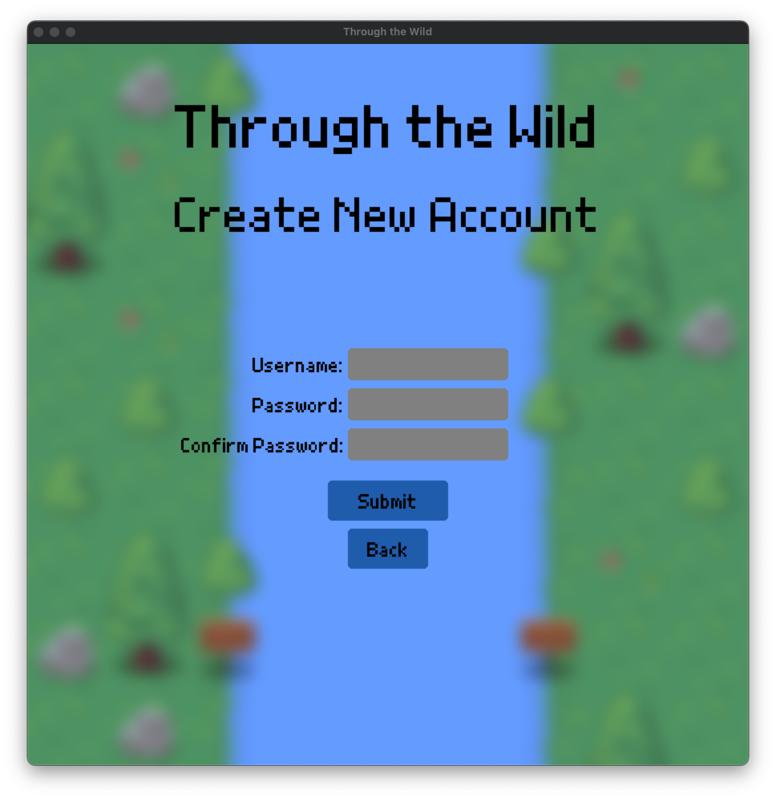
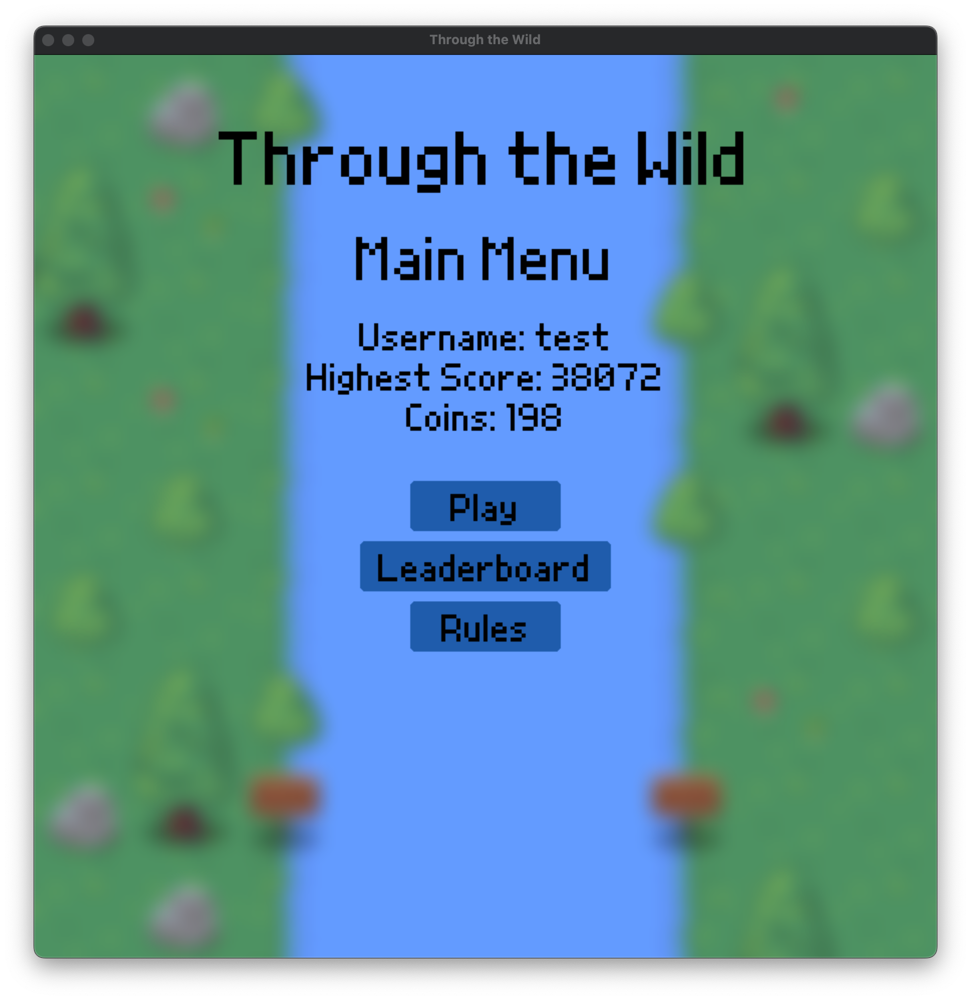
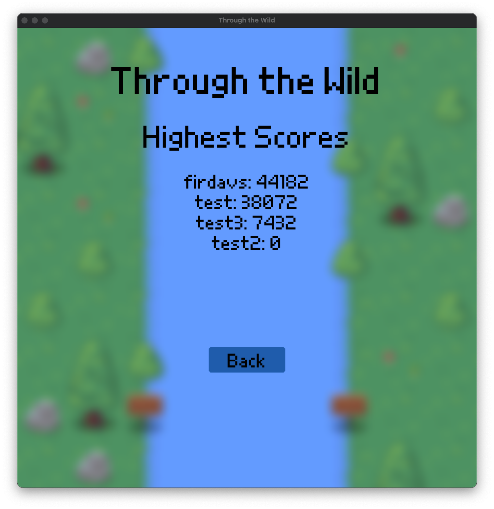
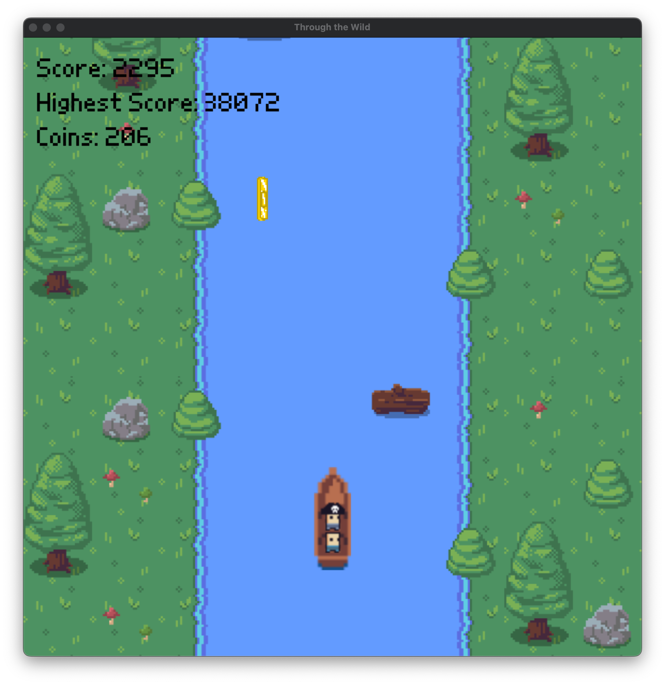

# Through the Wild - game
> A simple endless runner boat game made with Pygame

## Table of Contents
* [General Info](#general-information)
* [Technologies Used](#technologies-used)
* [Features](#features)
* [Screenshots](#screenshots)
* [Setup](#setup)
* [Usage](#usage)
* [Project Status](#project-status)
* [Room for Improvement](#room-for-improvement)
* [Contact](#contact)
<!-- * [License](#license) -->

## General Information
An endless runner with a boat in the water. The player must steer a boat down a river while dodging obstacles and trying to stay alive. The player's goal is to reach a high score as there is a global leaderboard for players to see others with the highest scores.

This project was initially a final project for my Game Design class in my Senior year of high school. However, I was hosting the database for the game on my school servers which I didn't have access to after graduation. And so, I redid the whole thing to make the code more structured and instead use AWS to host the database.

## Technologies Used
- Pygame - version 2.1.2
- mysql.connector - version 2.1.9
- Pandas - version 1.4.3

## Features
- Unique boat mechanics that model a real boat going down a river.
- Global leaderboard with the use of a web-hosted relational database.
- Login/signup system to be able to save users' data.

## Screenshots

  
  

  
  

  

## Setup
Run setup.py to install all requirements listed in requirements.txt

## Usage
Run main.py to run the game. You must have internet for it to work as the game connects to a web-hosted database.

After the window opens, login with your account. If you don't have one, create one.

## Project Status
Project is: _in progress_

## Room for Improvement
Room for improvement:
- Make response time better with database connection by decreaseing the amount of necessary calls to it.

To do:
- Add the ability to revive with coins.
- Add shop to buy skins for boats, and maybe backgrounds.
- Add additional parts of the game (images in /Images)
    - Different parts of the river
    - Different obstacles
    - Add enemies that chase you in the river

## Contact
Created by @FirdavsN
